<div align="center">

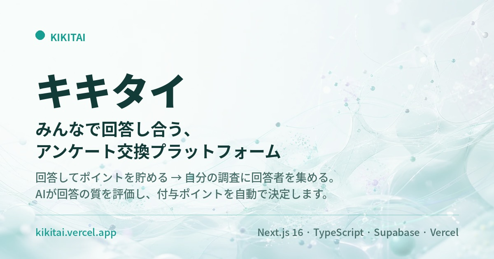

# キキタイ

**「アンケートの回答者が集まらない」を、お互いさまで解決する。**

学生・研究者どうしが回答を交換し合う、ポイント制のアンケートプラットフォーム。<br>
回答の質は AI が自動評価し、付与ポイントを 5 段階で決定します。

[](https://github.com/saltyland/kikitai-public/actions/workflows/ci.yml)
[](https://nextjs.org/)
[](https://www.typescriptlang.org/)
[](https://supabase.com/)
[](https://kikitai.vercel.app)
[](LICENSE)

### ▶ **[デモを触る（登録不要）](https://kikitai.vercel.app)**

トップページの「デモを試す」から、アカウント登録なしで一連の流れを体験できます。

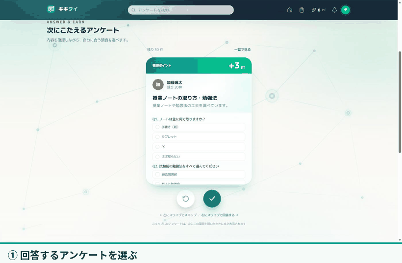

<sub>アンケートに回答すると、AI が回答品質を採点し、その質に応じてポイントが付与されます（実際の操作を記録したもの）。</sub>

</div>

---

## 目次

- [解決したい課題](#解決したい課題)
- [仕組み](#仕組み)
- [画面](#画面)
- [このプロジェクトの技術的な見どころ](#このプロジェクトの技術的な見どころ)
- [技術スタック](#技術スタック)
- [アーキテクチャ](#アーキテクチャ)
- [データモデル](#データモデル)
- [品質への取り組み](#品質への取り組み)
- [主な機能](#主な機能)
- [ローカルで動かす](#ローカルで動かす)
- [ドキュメント](#ドキュメント)
- [プロジェクト規模](#プロジェクト規模)
- [ライセンス](#ライセンス)

---

## 解決したい課題

卒論・修論・ゼミ・研究室の調査でアンケートを配るとき、ほぼ全員が同じ壁にぶつかります。

> **「回答者が集まらない」**

SNS で拡散しても回答は伸びず、集まっても属性が偏る。知り合いに頼めば人間関係のコストがかかる。
一方で、大学には「自分もアンケートを配りたい人」が同時に大量にいます。

キキタイは、この需要と供給を **ポイントを媒介にした相互扶助** で噛み合わせます。

---

## 仕組み

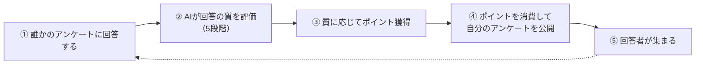

**設計上のポイント**

| 仕掛け | ねらい |
|---|---|
| ポイントは **180 日で失効**（FIFO 消費） | 貯め込みを防ぎ、循環を止めない |
| 設問タイプ別のコスト（記述式は選択式の 4 倍） | 回答者の負担に見合った対価を作成者に払わせる |
| **AI による回答品質評価**（付与率 0 / 30 / 50 / 80 / 100%） | 「雑に答えてポイントだけ稼ぐ」フリーライドを防ぐ |
| 高品質回答時の **作成者へのポイント還元** | 良い設問を作るインセンティブ |
| 回答前の **インフォームドコンセント画面** を必須化 | 研究倫理審査に耐える設計 |

---

## 画面

| | |
|---|---|
| 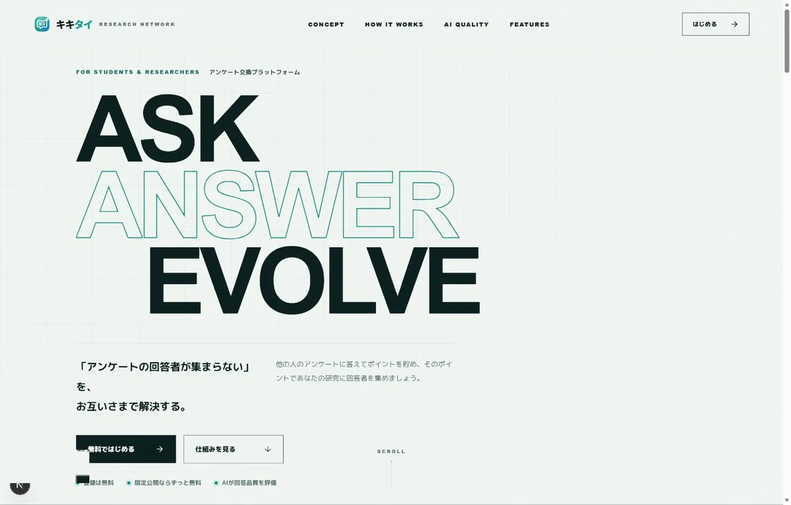<br>**ランディングページ**<br>サービスの立ち位置と 3 ステップの循環を提示 | 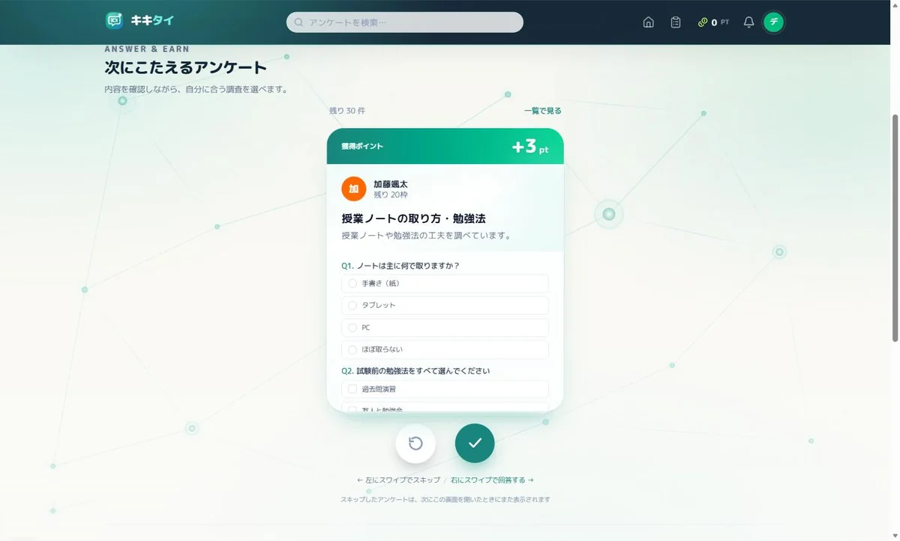<br>**ホーム**<br>属性に合うアンケートをカード形式で 1 件ずつ提示。獲得予定ポイントを先に表示 |
| 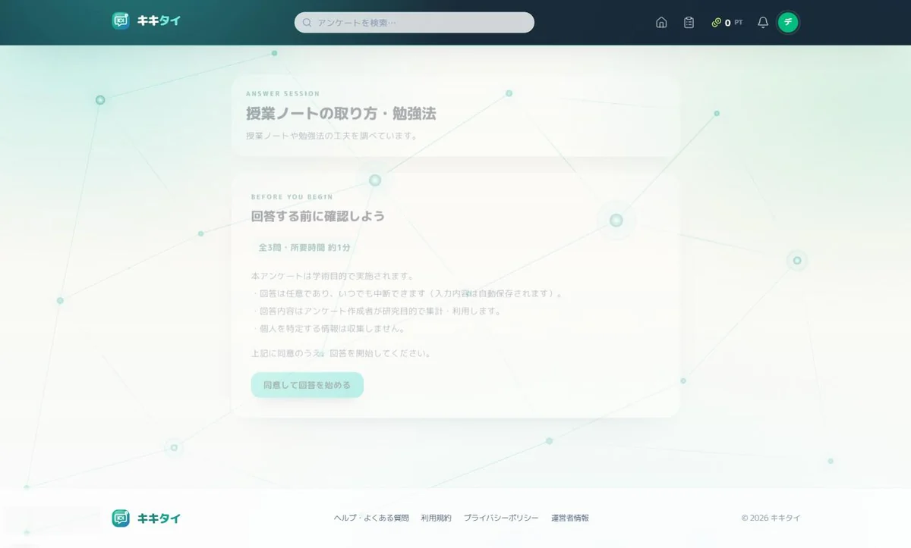<br>**インフォームドコンセント**<br>回答前に必ず表示。研究倫理審査に耐える設計 | 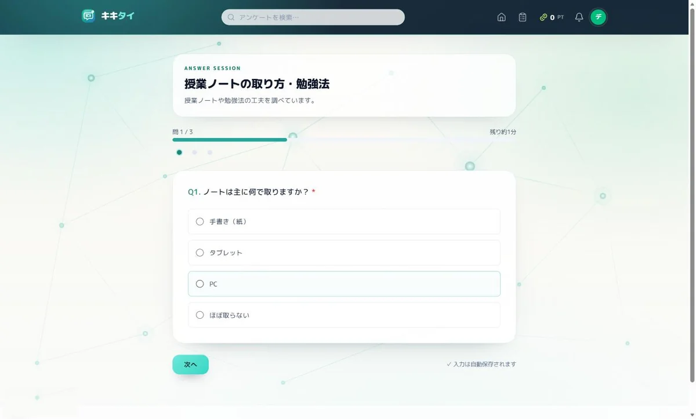<br>**回答フロー**<br>セクション送り・進捗バー・自動保存 |
| 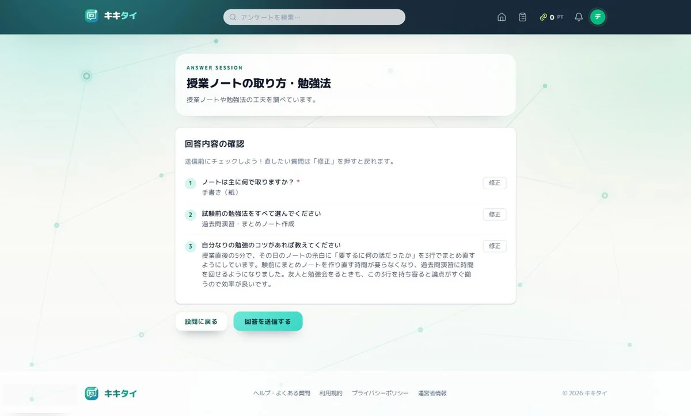<br>**送信前の確認**<br>設問ごとに「修正」で戻れる | 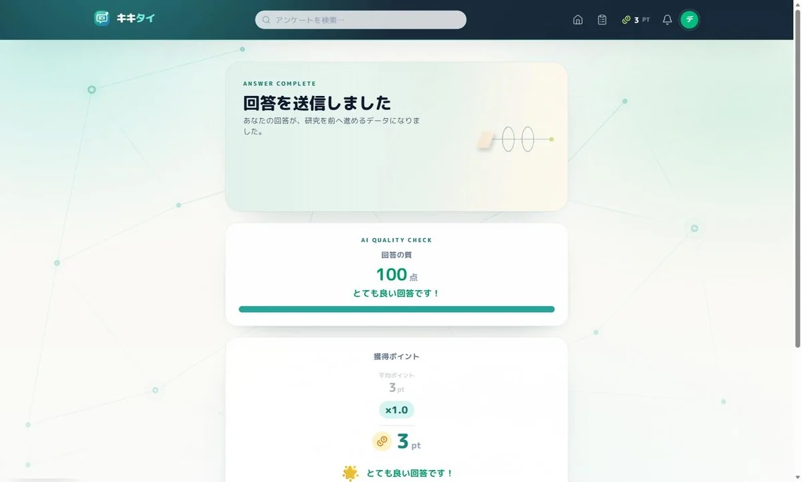<br>**AI 採点結果**<br>品質スコア・付与率・獲得ポイント・AI からのフィードバック |
| 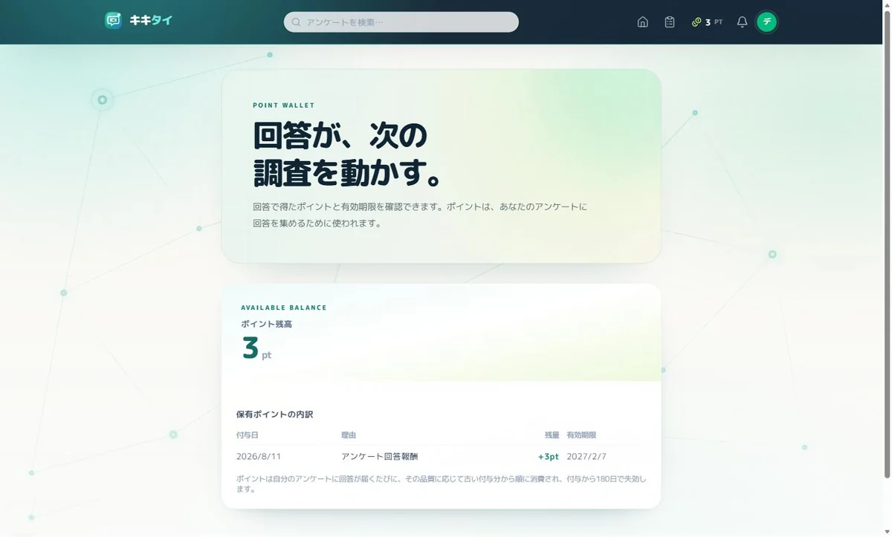<br>**ポイントウォレット**<br>付与単位（ロット）ごとの残量と失効日を表示 | 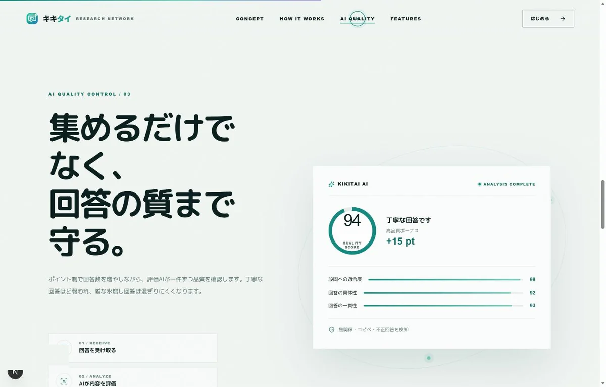<br>**AI 品質評価の紹介**<br>採点軸とスコアの見え方をサービス側でも説明 |

---

## このプロジェクトの技術的な見どころ

### 1. AI による回答品質評価（2 層 + 締切つき合成）

「手抜き回答を弾きたい」が「真面目な回答を誤って 0pt にはしたくない」という**非対称なコスト**を、
ルールベースと LLM の 2 層構成で扱っています。

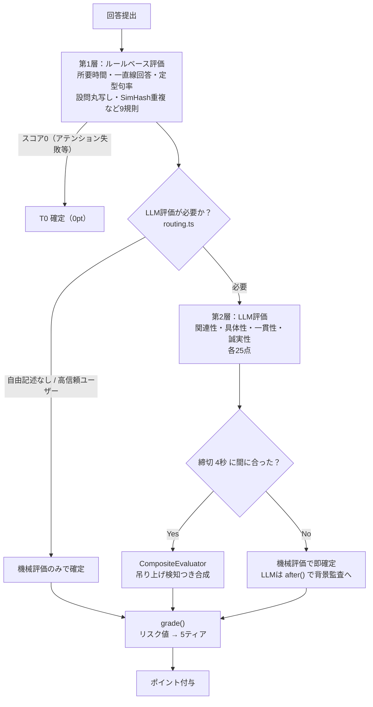

- **締切つき同期採点** — LLM 評価には締切（既定 4 秒・`QUALITY_DEADLINE_MS`）を設け、超過したら機械評価のスコアで即座に採点を確定してポイントを付与します。走り続ける LLM 評価は Next.js の `after()` で応答送信後に回し、即時確定値との乖離を監査ログに残します。
- **プロンプトインジェクション対策** — 回答は `<survey_data>` タグで封じ込め、LLM スコアがルールスコアを 15 点以上上回った場合は「吊り上げ疑い」としてルールスコアを上限にします。
- **閾値はコード外** — 5 ティアの境界値は `calibration.json` に切り出し、人手ラベル 400 件からロジスティック回帰で自動算出。**再デプロイなしで再調整**できます。
- **フォールバック連鎖** — ローカル LLM（Ollama 等）→ Gemini → Groq → Cerebras → ルールベース。


<sub>回答者にはスコア・付与率・獲得ポイント・フィードバックがその場で確定値として返ります。</sub>

📄 詳細: **[docs/評価AI_仕組み.md](docs/評価AI_仕組み.md)**

### 2. ポイント経済の整合性を DB 側で担保

ポイントの二重付与・残高マイナスは、このサービスでは**そのまま経済の破綻**を意味します。
アプリ層の read-modify-write を避け、PostgreSQL の RPC 関数 1 トランザクションに閉じ込めています。

| 関数 | 役割 |
|---|---|
| `consume_points` | 付与日時の昇順（FIFO）に**行ロック**しながら減算。残高不足は全体ロールバック |
| `publish_survey` | 公開コストの消費と `open` 化を 1 トランザクションで |
| `submit_survey_response` | 回答保存・ポイント付与・信頼スコア更新・上限到達時の自動 `close`・通知を 1 トランザクションで |
| `sync_points_balance` | 残高を 1 文の `UPDATE` で集計同期（lost update 対策） |

ビジネスエラーは `KIKITAI:<CODE>:<詳細>` 形式で `raise exception` し、アプリ側で日本語メッセージに変換しています。


<sub>残高は「期限内ロットの合計」。付与単位ごとに失効日を持ち、消費は古い付与分から順に行われます。</sub>

### 3. Row Level Security による多層防御

全テーブルで RLS を有効化。他人のプロフィールは `points` / `trust_score` を落とし
`private_fields` でマスクした **`public_profiles` ビュー経由でしか読めません**。
回答内容は「本人」と「アンケート作成者」だけが `select` できます。

---

## 技術スタック

| 領域 | 採用技術 | 選定理由（詳細は [ADR](docs/ADR.md)） |
|---|---|---|
| フレームワーク | Next.js 16（App Router / Server Actions） | サーバー側でのみ秘密情報を扱い、API 層を別途立てずに済む |
| 言語 | TypeScript 5（`strict`） | ドメインロジックを型で守る |
| UI | Tailwind CSS v4 / Framer Motion / GSAP / Lenis | デザイントークンを CSS 変数に集約、体験の質で差別化 |
| DB / 認証 | Supabase（PostgreSQL + Auth + RLS） | RLS で認可を DB に寄せられる。個人開発規模で運用コストが低い |
| グラフ | Recharts | 集計・クロス集計の可視化 |
| AI 評価 | Gemini 2.5 Flash / Groq / Cerebras / ローカル LLM（OpenAI 互換） | 無料枠と速度を組み合わせ、単一ベンダー障害で止めない |
| 埋め込み | `@huggingface/transformers`（ブラウザ内推論） | 関連性判定を外部 API なしで実行 |
| テスト | Vitest | 234 ケース / 24 ファイル |
| CI | GitHub Actions | 型チェック → Lint → テスト → ビルド |
| ホスティング | Vercel（Cron Jobs 含む） | ポイント失効・データ保持期限の定期実行まで一元化 |

---

## アーキテクチャ

UI・ビジネスロジック・データアクセスを分離した 4 層構成です。UI から DB を直接触りません。

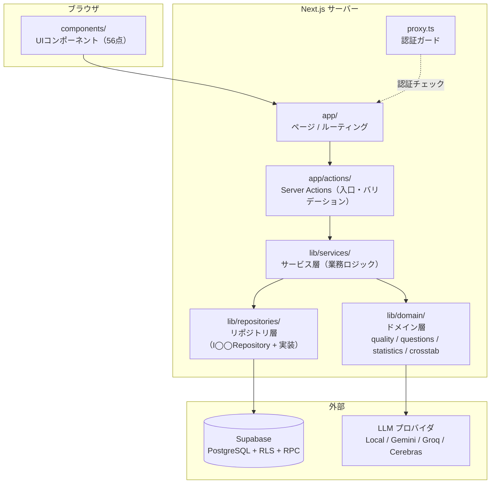

```
app/                    ページ（App Router）
  actions/              Server Actions（フォーム送信の入口）
  api/cron/             Vercel Cron（ポイント失効・データ保持期限）
components/             UIコンポーネント
lib/
  domain/               ドメインロジック（外部依存なし・テスト対象の中心）
    quality/            回答品質評価（ルールベース / LLM / 合成 / grade）
    questions/          設問タイプの多態（Choice / Text / Grid / Attention）
    generation/         AIによる設問自動生成
  services/             サービス層（リポジトリを組み合わせた業務ロジック）
  repositories/         DBアクセス層（インターフェース + 実装）
  security/             サニタイズ・ボット対策
  types/                型定義
proxy.ts                認証ガード（Next.js 16 の middleware 相当）
supabase/migrations/    DBスキーマ（25本・すべて冪等）
```

---

## データモデル

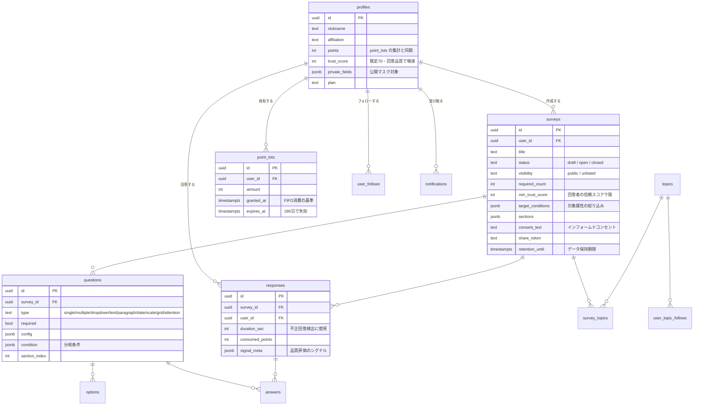

---

## 品質への取り組み

| 観点 | 内容 |
|---|---|
| **型** | TypeScript `strict`。CI で `tsc --noEmit` を必須化 |
| **テスト** | Vitest **234 ケース / 24 ファイル**。品質評価・統計・クロス集計・状態遷移などドメイン層を重点的に |
| **CI** | PR と `main` への push で 型チェック → Lint → テスト → ビルド を自動実行 |
| **状態遷移** | `draft → open → closed` を状態機械（`surveyStateMachine.ts`）で表現し、DB トリガでも二重に防御 |
| **セキュリティヘッダー** | HSTS / `X-Content-Type-Options` / `X-Frame-Options` / `Referrer-Policy` / `Permissions-Policy` を全レスポンスに付与 |
| **認可** | 全テーブル RLS。他人のプロフィールはマスク済みビュー経由のみ |
| **ボット対策** | Cloudflare Turnstile による匿名アカウント大量作成の抑止 |
| **プライバシー** | LLM へ送るのは設問文と回答テキストのみ（ユーザー ID・属性・IP は送らない）。保持期限超過データは Cron で自動削除 |
| **マイグレーション** | 25 本すべて冪等（`if not exists` / `drop → create`）。再適用しても壊れない |

---

## 主な機能

<details>
<summary><b>アンケート作成（Google フォーム相当）</b></summary>

- 9 種の設問タイプ：ラジオ / チェックボックス / プルダウン / 記述式（短文）/ 段落（長文）/ 日付 / スケール（可変・両端ラベル）/ グリッド（選択式・チェックボックス）/ アテンションチェック
- 設問の必須化・説明文、セクション（ページ分割）、条件分岐
- ドラッグ & ドロップ並べ替え・複製
- AI による設問の自動生成・改善提案
- 下書き / 公開 / 終了 の状態管理、限定公開（URL 共有）

</details>

<details>
<summary><b>回答</b></summary>

- 自分の属性・信頼スコアに合致するアンケートのみ表示
- インフォームドコンセント画面、セクション送り + 進捗バー
- 必須バリデーション、重複回答防止
- 送信直後に AI 評価スコアと獲得ポイントを表示（4 秒以内保証）

</details>

<details>
<summary><b>結果分析</b></summary>

- 回答数・集計グラフ・クロス集計
- CSV / Excel ダウンロード（作成者のみ）
- サマリーレポート出力

</details>

<details>
<summary><b>ポイント / ソーシャル</b></summary>

- ポイント履歴、失効予定の可視化、失効前通知
- 信頼スコア、ユーザーフォロー、トピックフォロー
- 通知センター、トピックダイジェスト

</details>

---

## ローカルで動かす

### 前提

- Node.js 20 以上
- Supabase プロジェクト（無料枠で可）

### 1. インストール

```bash
npm install
```

### 2. 環境変数

`.env.local.example` をコピーして `.env.local` を作成し、値を埋めます。

```bash
cp .env.local.example .env.local
```

| 変数 | 必須 | 用途 |
|---|---|---|
| `NEXT_PUBLIC_SUPABASE_URL` | ✅ | Supabase プロジェクト URL |
| `NEXT_PUBLIC_SUPABASE_ANON_KEY` | ✅ | 公開用 anon キー |
| `SUPABASE_SERVICE_ROLE_KEY` | | 退会機能（`auth.users` ごと削除）に使用 |
| `GEMINI_API_KEY` ほか | | AI 品質評価。**未設定でもルールベース評価のみで動作します** |
| `LOCAL_LLM_URL` | | Ollama / LM Studio 等の OpenAI 互換サーバ |
| `NEXT_PUBLIC_TURNSTILE_SITE_KEY` | | ボット対策（本番のみ推奨） |

### 3. DB スキーマの反映

```bash
npm run sync
```

`supabase/migrations/` のマイグレーション適用と、開発用のメール確認 OFF 設定をまとめて実行します。
マイグレーションは冪等なので、既存 DB に対して再実行しても安全です。

### 4. 起動

```bash
npm run dev      # http://localhost:3000
```

### その他のコマンド

```bash
npm test         # Vitest（234ケース）
npm run lint     # ESLint
npm run build    # 本番ビルド
npm run db:new <name>   # 新しいマイグレーションの雛形
npm run benchmark       # 品質評価のベンチマーク
```

---

## ドキュメント

| ドキュメント | 内容 |
|---|---|
| [要件定義](docs/REQUIREMENTS.md) | 課題設定・スコープ・機能要件・非機能要件 |
| [アーキテクチャ](docs/ARCHITECTURE.md) | 層構成・データフロー・主要な設計判断 |
| [技術選定の記録（ADR）](docs/ADR.md) | なぜその技術を選び、何を捨てたか |
| [開発の記録](docs/DEVELOPMENT_LOG.md) | 進め方・工数・つまずきと解決 |
| [評価 AI の仕組み](docs/評価AI_仕組み.md) | 品質評価の全ロジックと較正パイプライン |
| [リリースチェックリスト](docs/リリースチェックリスト.md) | 一般公開前の確認項目 |
| [コントリビューション](CONTRIBUTING.md) | ブランチ運用・PR の出し方 |

---

## プロジェクト規模

| 指標 | 値 |
|---|---|
| TypeScript / TSX | 約 28,500 行 |
| UI コンポーネント | 56 |
| DB マイグレーション | 25（すべて冪等） |
| テスト | 234 ケース / 24 ファイル |
| コミット | 310+ |
| 設問タイプ | 9 種 |

---

## ライセンス

**[Kikitai Source-Available License](LICENSE)** — 閲覧・評価目的に限り無償で許諾します。

本リポジトリは、開発内容を読み・レビューし・評価していただくために公開しています。
コードの閲覧、読解目的でのクローン、評価目的でのローカル実行、出典を示した短い引用は自由に行えます。
一方で、製品・サービス・社内システムへの組み込み、再配布、本コードに基づくサービスの運営には
著作権者の事前の書面による許諾が必要です。詳細は [LICENSE](LICENSE) を参照してください。

> 本リポジトリは学内プロジェクトの成果物を一般公開用に整理したものです。
> 開発履歴から API キー等の秘密情報は除去済みです。
