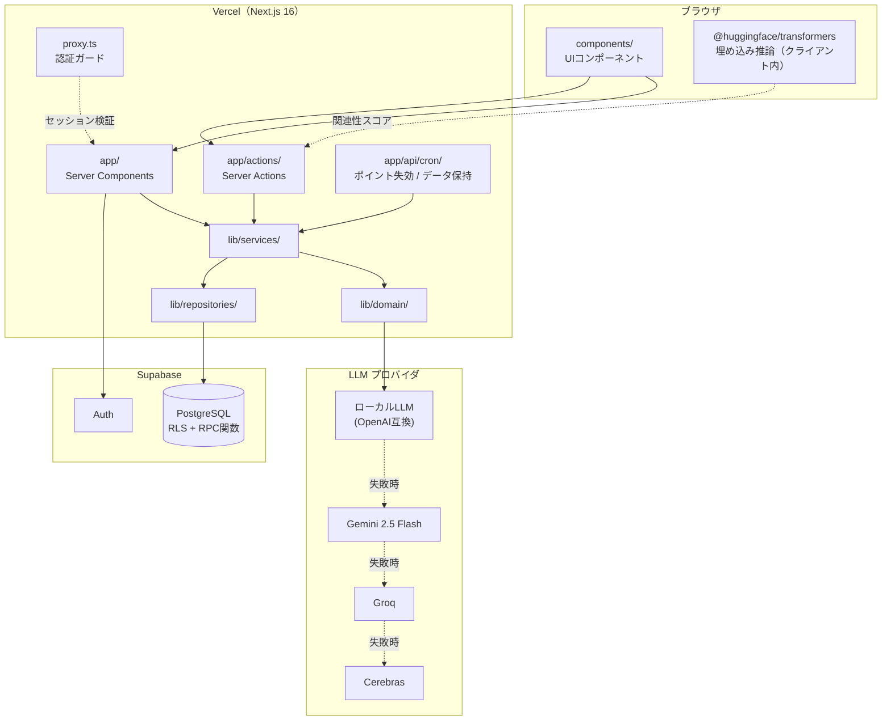
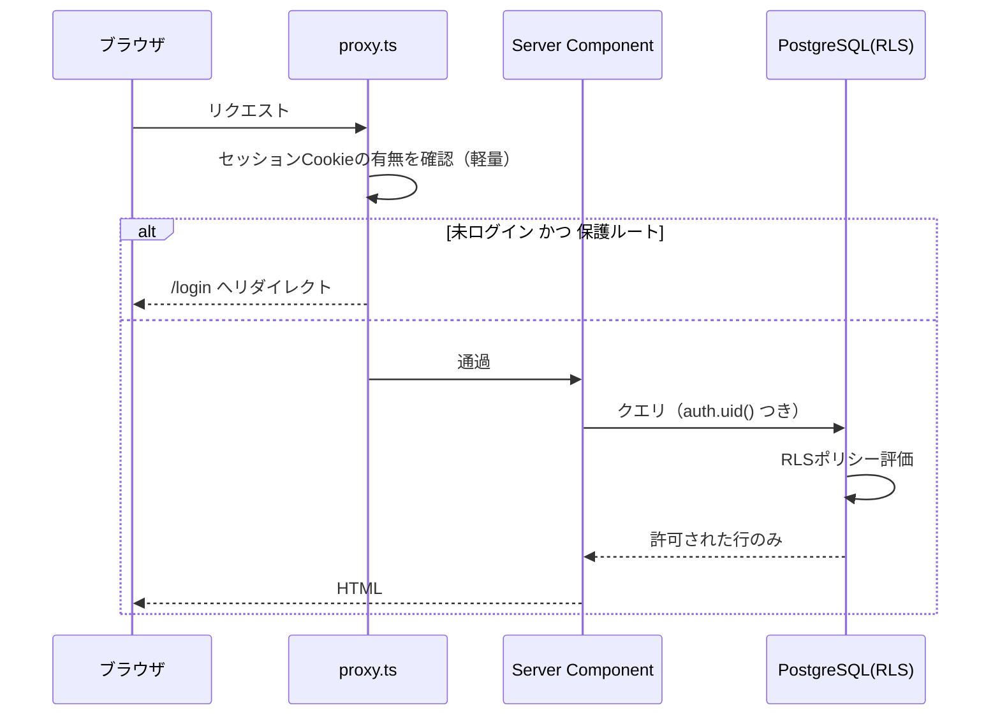
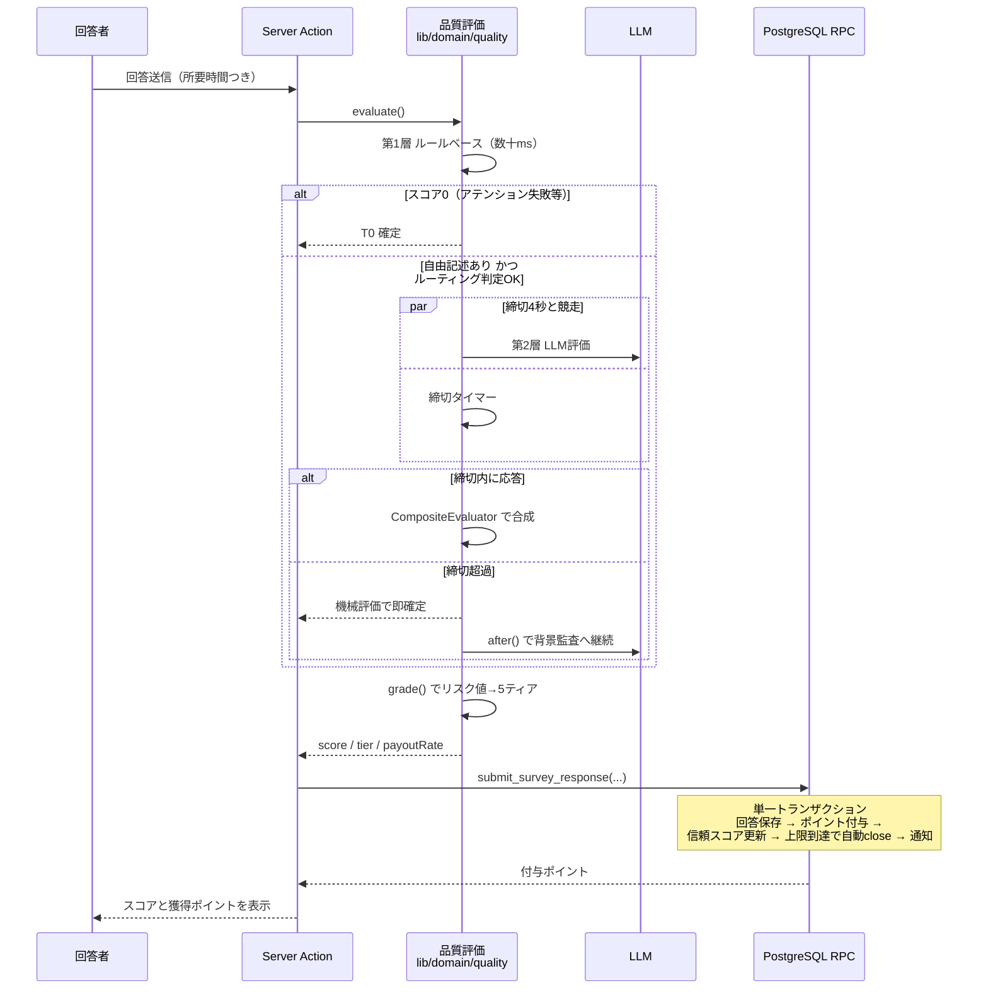
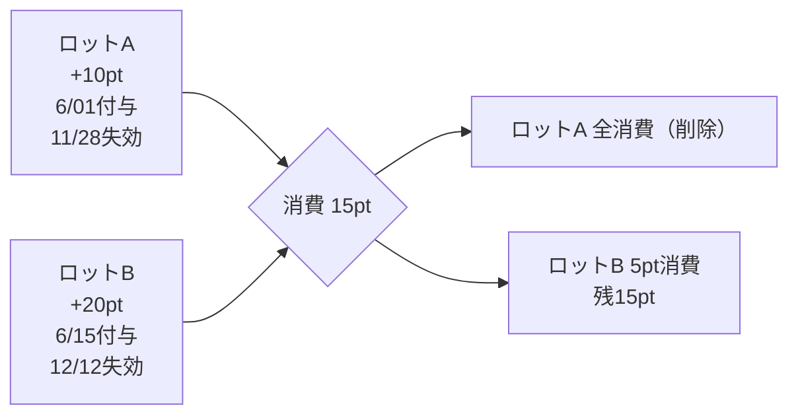

# アーキテクチャ

最終更新: 2026-08-11

---

## 1. 全体構成



## 2. レイヤの責務

| 層 | ディレクトリ | 責務 | 依存してよい先 |
|---|---|---|---|
| プレゼンテーション | `components/` | 表示とユーザー操作のみ。DB を直接参照しない | Server Actions |
| ルーティング | `app/` | ページ構成、データ取得の起点 | サービス層 |
| 入口 | `app/actions/` | 入力バリデーション（Zod）、認証確認、サービス呼び出し | サービス層 |
| サービス | `lib/services/` | 複数リポジトリ・ドメインを組み合わせた業務ロジック | ドメイン層 / リポジトリ層 |
| ドメイン | `lib/domain/` | 純粋なビジネスルール。**外部 I/O を持たない**（LLM クライアントは注入） | なし |
| リポジトリ | `lib/repositories/` | DB アクセス。`I◯◯Repository` インターフェースと実装に分離 | Supabase クライアント |
| インフラ | `lib/supabase/` | browser / server / proxy 用クライアントの生成 | — |

**依存の向きは常に外→内**。ドメイン層は他のどの層にも依存しない。
これにより、234 ケースの単体テストがモック無しで、あるいは軽量なフェイクだけで書けている。

## 3. 認証とルート保護

Next.js 16 では `middleware.ts` が `proxy.ts` に置き換わった。
`proxy.ts` はセッション Cookie の存在だけを高速に確認し、
本格的な認可判定は各ページ / Server Action と DB の RLS に委ねる二段構えとしている。



## 4. 回答送信のシーケンス

サービスの中核。**採点・ポイント付与・状態更新を破綻させない**ことに全体が設計されている。



## 5. ポイント経済の整合性設計

### 5.1 なぜ DB 側に寄せたか

ポイントは「読んで → 計算して → 書き戻す」形で扱うと、
同時回答が発生した瞬間に **lost update**（片方の更新が消える）が起きる。
このサービスではそれが直ちに残高の不整合＝経済の破綻になるため、
整合性が必要な操作はすべて PostgreSQL の RPC 関数に閉じ込めている。

### 5.2 主要な RPC 関数

| 関数 | 保証していること |
|---|---|
| `consume_points(user_id, amount)` | `granted_at` 昇順に `FOR UPDATE` で行ロックしながら減算。束をまたぐ場合は分割。残高不足なら例外を投げて全体ロールバック |
| `publish_survey(...)` | 公開コストの消費と `status = 'open'` 化を 1 トランザクションで実行。どちらかだけ成功する状態を作らない |
| `submit_survey_response(...)` | 回答保存・付与・信頼スコア更新・自動 `close`・通知を 1 トランザクションで実行 |
| `sync_points_balance(user_id)` | `profiles.points` を `point_lots` の集計値に 1 文の `UPDATE` で同期（read-modify-write を発生させない） |
| `question_point_cost(type)` | 設問タイプ別単価。`lib/domain/questions/` の `pointCost` と同期させる必要がある |

ビジネスエラーは `KIKITAI:<CODE>:<詳細>` 形式で `raise exception` し、
`lib/repositories/dbError.ts` が日本語メッセージへ変換する。
**DB とアプリのエラー表現の境界を 1 箇所に集約**している。

### 5.3 ポイントロット（有効期限つき残高）



残高 = 期限内ロットの合計。失効は日次 Cron（`/api/cron/expire-points`）が処理する。

## 6. 品質評価アーキテクチャ

詳細は [評価AI_仕組み.md](./評価AI_仕組み.md) を参照。設計上の要点のみ記す。

| 判断 | 内容 | 理由 |
|---|---|---|
| 2 層構成 | ルールベース（必須）+ LLM（条件付き） | LLM を呼ばなくても最低限の品質判定が成立する。API 全滅でもサービスが止まらない |
| 締切つき同期採点 | 既定 4 秒。超過分は `after()` で背景監査 | 回答者を待たせない。CPU 推論のローカル LLM でも UX が壊れない |
| 吊り上げ検知 | LLM スコアがルールスコアを 15 点以上上回ったらルールスコアを上限に | プロンプトインジェクションによるスコア操作を無効化 |
| 安全弁 | `mechRisk < 0.15` なら最低でも L1c（30%）を保証 | LLM 単独の誤判定で真面目な回答を 0pt にしない |
| 閾値の外部化 | `calibration.json` を起動時ロード | 再デプロイなしで運用調整できる |
| プロバイダ抽象化 | `QualityEvaluator` インターフェースに 5 実装 | ベンダーロックインを避け、ローカル LLM も同列に扱える |

## 7. 設問タイプの多態

9 種の設問タイプを `switch` の羅列にせず、`QuestionTypeDefinition` を実装するクラス群に分離している。

```
lib/domain/questions/
  QuestionTypeDefinition.ts   インターフェース（pointCost / validate / summarize など）
  ChoiceQuestion.ts           single / multiple / dropdown / scale / date
  TextQuestion.ts             text / paragraph
  GridQuestion.ts             grid
  AttentionQuestion.ts        attention（正解判定を持つ）
  registry.ts                 タイプ名 → 定義の解決
  visibility.ts               条件分岐による表示判定
```

新しい設問タイプの追加は「クラスを 1 つ足して registry に登録する」だけで済み、
バリデーション・集計・コスト計算の各所を触る必要がない。

## 8. デプロイ構成

| 対象 | 場所 |
|---|---|
| アプリケーション | Vercel（`main` への push で自動デプロイ） |
| DB / 認証 | Supabase |
| 定期実行 | Vercel Cron（`vercel.json`）<br/>・`/api/cron/expire-points` 毎日 03:00 JST<br/>・`/api/cron/data-retention` 毎日 03:30 JST |
| Cron 認証 | `cronAuth.ts` による共有シークレット検証 |
| セキュリティヘッダー | `next.config.ts` の `headers()` で全レスポンスに付与 |

## 9. 既知の制約と今後

| 項目 | 現状 | 方針 |
|---|---|---|
| `question_point_cost` の二重定義 | SQL 側とドメイン層に単価表が存在する | 片方を正とし、もう片方を生成する仕組みに寄せたい |
| E2E テスト | 未整備（単体テスト 234 ケースのみ） | Playwright で主要導線を押さえる |
| 背景監査ログ | 記録のみ。事後の信頼スコア減点は未接続 | Phase 4 で接続 |
| 関連性リスク（relRisk） | 参照ベクトル方式を実装済みだが本番運用は限定的 | 較正データ蓄積後に本格適用 |
